# anydesk Design System

You are building UI for **anydesk**. Dark-themed, cool palette, sans-serif typography (Times New Roman), compact density on a 4px grid.

## Visual Reference

**IMPORTANT**: Study ALL screenshots below before writing any UI. Match colors, typography, spacing, layout, and motion exactly as shown.

### Homepage

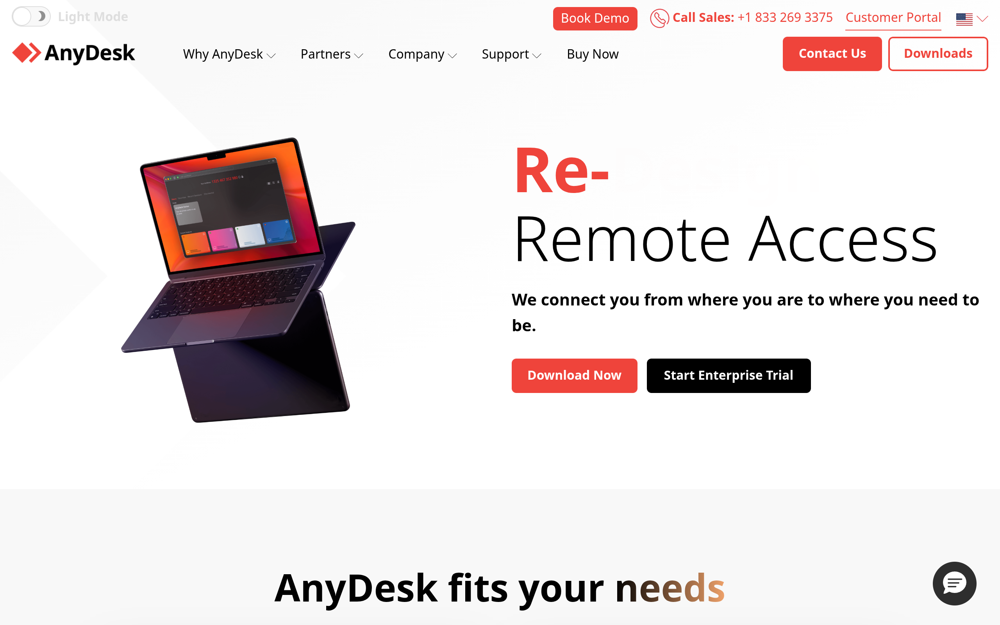

### Scroll Journey (Cinematic Visual States)

> These screenshots capture the website at different scroll depths. The design changes dramatically as you scroll — each frame shows a different cinematic state. Replicate these exact visual transitions.

#### 0% — Hero / Above the fold

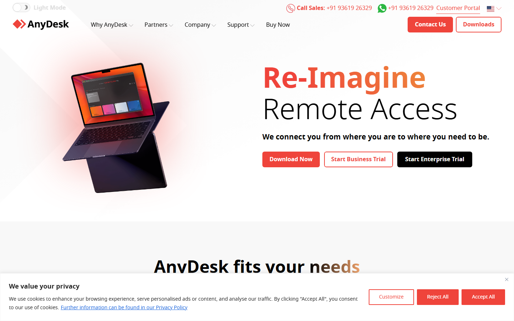

#### 17% — Mid-page at 17% scroll

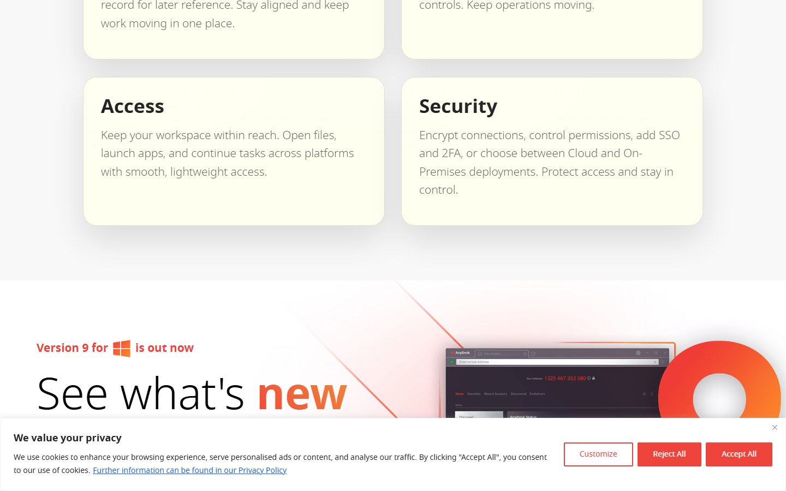

#### 33% — Mid-page at 33% scroll

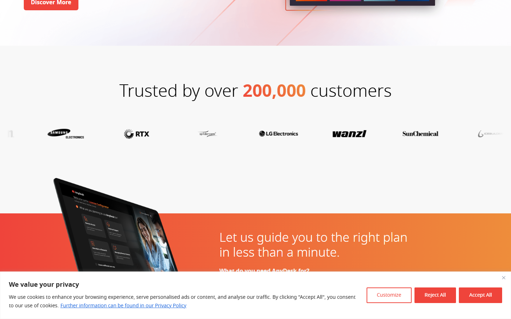

#### 50% — Mid-page at 50% scroll

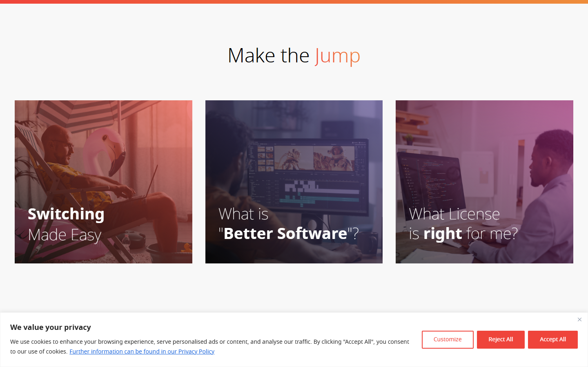

#### 67% — Mid-page at 67% scroll

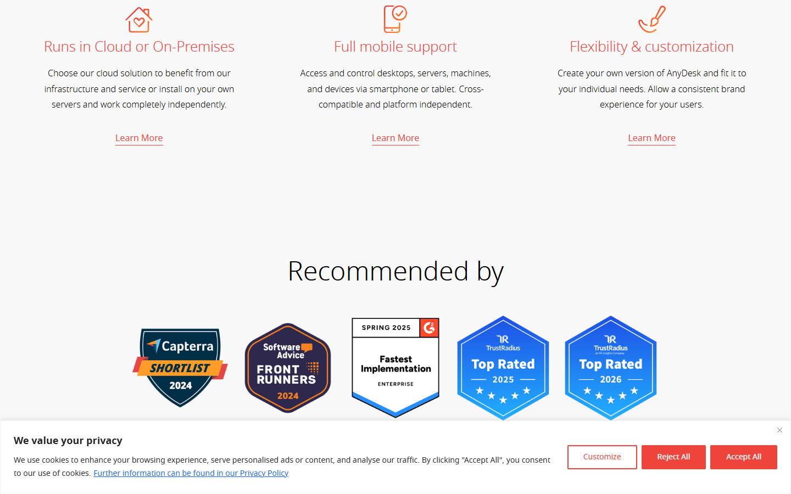

#### 83% — Mid-page at 83% scroll

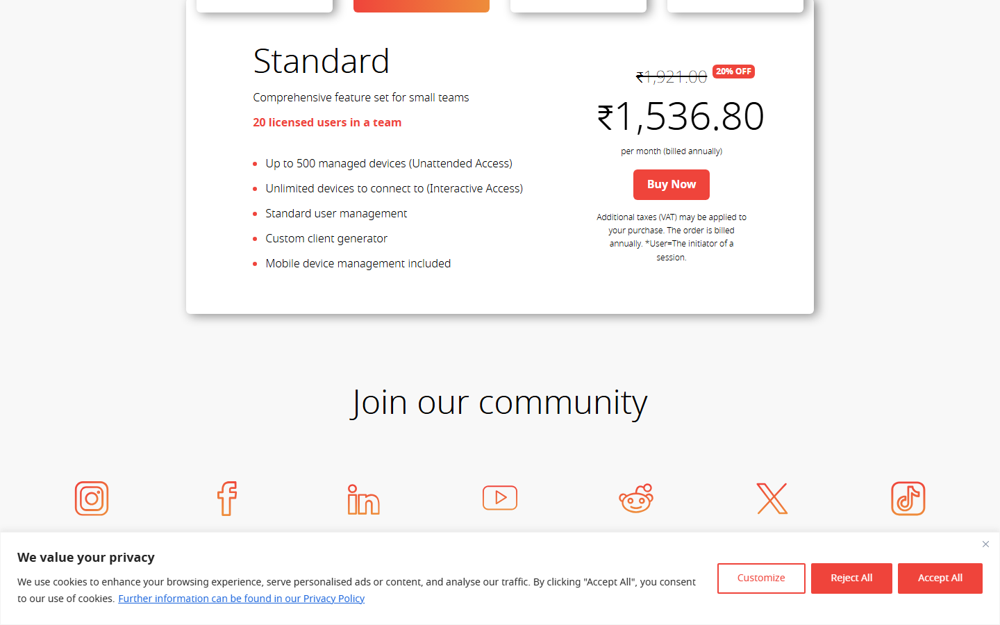

#### 100% — Footer / End of page

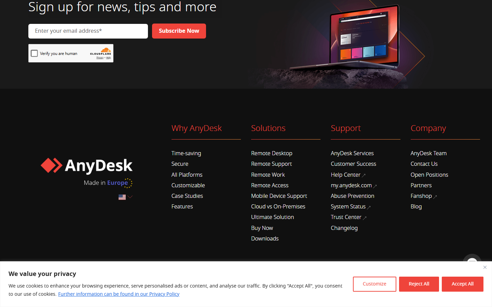

> Read `references/DESIGN.md` for full token details. Read `references/ANIMATIONS.md` for motion specs. Read `references/LAYOUT.md` for layout structure. Read `references/COMPONENTS.md` for component patterns.

## Ultra Reference Files

This package includes extended documentation. **Read these files before implementing:**

| File | Contents |
|------|----------|
| `references/DESIGN.md` | Full design system tokens, colors, typography, spacing |
| `references/VISUAL_GUIDE.md` | **START HERE** — Master visual guide with all screenshots embedded |
| `references/ANIMATIONS.md` | CSS keyframes, scroll triggers, motion library stack, video specs |
| `references/LAYOUT.md` | Flex/grid containers, page structure, spacing relationships |
| `references/COMPONENTS.md` | DOM component patterns, HTML structure, class fingerprints |
| `references/INTERACTIONS.md` | Hover/focus states with before/after style diffs |
| `screens/scroll/` | 7 scroll journey screenshots showing cinematic states |

### Animation Stack Detected

- **Web Animations API (6 active)** — animation

## Design Philosophy

- **Layered depth** — use shadow tokens to create a sense of physical layering. Each elevation level has a specific shadow.
- **Solid colors only** — no gradients anywhere. Every surface is a single flat color.
- **Type pairing** — Times New Roman for body/UI text, Noto Sans for headings/display. Never introduce a third typeface.
- **compact density** — 4px base grid. Every dimension is a multiple of 4.
- **cool palette** — the color temperature runs cool, matching the sans-serif typography.
- **Restrained accent** — `#1863dc` is the only pop of color. Used exclusively for CTAs, links, focus rings, and active states.
- **Minimal motion** — prefer instant state changes. Only use transitions for loading and page transitions.

## Color System

### Core Palette

| Role | Token | Hex | Use |
|------|-------|-----|-----|
| Background | `--background` | `#000000` | Page/app background |
| Surface | `--surface` | `#2e2e2e` | Cards, panels, modals |
| Text Primary | `--text-primary` | `#ffffff` | Headings, body text |
| Accent | `--accent` | `#1863dc` | CTAs, links, focus rings |
| Border | `--border` | `#1a1a1a` | Dividers, card borders |

### Status Colors

| Status | Hex | Use |
|--------|-----|-----|
| Success | `#008000` | Confirmations, positive trends |
| Warning | `#856404` | Caution states, pending items |
| Danger | `#ef443b` | Errors, destructive actions |

### Extended Palette

- `#0000ee`
- `#d0d5d2`
- `#101010` — Deep background layer or shadow color

### CSS Variable Tokens

```css
--primary: #ef443b;
--secondary: #FF8E91;
```

## Typography

### Font Stack

- **Times New Roman** — Heading 1, Heading 2, Heading 3
- **Noto Sans** — Body, Caption

### Font Sources

```css
@font-face {
  font-family: "Noto Sans";
  src: url("fonts/NotoSans-SemiBold.ttf") format("truetype");
  font-weight: 600;
}
@font-face {
  font-family: "Noto Sans";
  src: url("fonts/NotoSans-Bold.ttf") format("truetype");
  font-weight: 700;
}
@font-face {
  font-family: "Noto Sans";
  src: url("fonts/NotoSans-Regular.ttf") format("truetype");
  font-weight: 400;
}
```

### Type Scale

| Role | Family | Size | Weight |
|------|--------|------|--------|
| Heading 1 | Times New Roman | 48px / 3rem | 700 |
| Heading 2 | Times New Roman | 32px / 2rem | 600 |
| Heading 3 | Times New Roman | 24px / 1.5rem | 600 |
| Body | Noto Sans | 16px / 1rem | 400 |
| Caption | Noto Sans | 12px / 0.75rem | 400 |

### Typography Rules

- Body/UI: **Times New Roman**, Headings: **Noto Sans** — these are the only display fonts
- Max 3-4 font sizes per screen
- Headings: weight 600-700, body: weight 400
- Use color and opacity for text hierarchy, not additional font sizes
- Line height: 1.5 for body, 1.2 for headings

## Spacing & Layout

### Base Grid: 4px

Every dimension (margin, padding, gap, width, height) must be a multiple of **4px**.

### Spacing Scale

`4, 8, 10, 12, 16, 20, 30, 32, 128, 140` px

### Spacing as Meaning

| Spacing | Use |
|---------|-----|
| 4-8px | Tight: related items (icon + label, avatar + name) |
| 12-16px | Medium: between groups within a section |
| 24-32px | Wide: between distinct sections |
| 48px+ | Vast: major page section breaks |

### Border Radius

Scale: `2px, 3.2px, 4px, 6px, 50px`
Default: `4px`

## Component Patterns

### Card

```css
.card {
  background: #2e2e2e;
  border: 1px solid #1a1a1a;
  border-radius: 4px;
  padding: 16px;
  box-shadow: rgba(0, 0, 0, 0.43) 5px 3px 15px 0px;
}
```

```html
<div class="card">
  <h3>Card Title</h3>
  <p>Card content goes here.</p>
</div>
```

### Button

```css
/* Primary */
.btn-primary {
  background: #1863dc;
  color: #ffffff;
  border-radius: 4px;
  padding: 8px 16px;
  font-weight: 500;
  transition: opacity 150ms ease;
}
.btn-primary:hover { opacity: 0.9; }

/* Ghost */
.btn-ghost {
  background: transparent;
  border: 1px solid #1a1a1a;
  color: #ffffff;
  border-radius: 4px;
  padding: 8px 16px;
}
```

```html
<button class="btn-primary">Get Started</button>
<button class="btn-ghost">Learn More</button>
```

### Input

```css
.input {
  background: #000000;
  border: 1px solid #1a1a1a;
  border-radius: 4px;
  padding: 8px 12px;
  color: #ffffff;
  font-size: 14px;
}
.input:focus { border-color: #1863dc; outline: none; }
```

```html
<input class="input" type="text" placeholder="Search..." />
```

### Badge / Chip

```css
.badge {
  display: inline-flex;
  align-items: center;
  padding: 4px 8px;
  border-radius: 9999px;
  font-size: 12px;
  font-weight: 500;
  background: #2e2e2e;
  color: #8c8c8c;
}
```

```html
<span class="badge">New</span>
<span class="badge">Beta</span>
```

### Modal / Dialog

```css
.modal-backdrop { background: rgba(0, 0, 0, 0.6); }
.modal {
  background: #2e2e2e;
  border: 1px solid #1a1a1a;
  border-radius: 50px;
  padding: 20px;
  max-width: 480px;
  width: 90vw;
  box-shadow: rgba(0, 0, 0, 0.43) 5px 3px 15px 0px;
}
```

```html
<div class="modal-backdrop">
  <div class="modal">
    <h2>Dialog Title</h2>
    <p>Dialog content.</p>
    <button class="btn-primary">Confirm</button>
    <button class="btn-ghost">Cancel</button>
  </div>
</div>
```

### Table

```css
.table { width: 100%; border-collapse: collapse; }
.table th {
  text-align: left;
  padding: 8px 12px;
  font-weight: 500;
  font-size: 12px;
  color: #8c8c8c;
  text-transform: uppercase;
  letter-spacing: 0.05em;
  border-bottom: 1px solid #1a1a1a;
}
.table td {
  padding: 12px;
  border-bottom: 1px solid #1a1a1a;
}
```

```html
<table class="table">
  <thead><tr><th>Name</th><th>Status</th><th>Date</th></tr></thead>
  <tbody>
    <tr><td>Item One</td><td>Active</td><td>Jan 1</td></tr>
    <tr><td>Item Two</td><td>Pending</td><td>Jan 2</td></tr>
  </tbody>
</table>
```

### Navigation

```css
.nav {
  display: flex;
  align-items: center;
  gap: 8px;
  padding: 12px 16px;
  border-bottom: 1px solid #1a1a1a;
}
.nav-link {
  color: #8c8c8c;
  padding: 8px 12px;
  border-radius: 4px;
  transition: color 150ms;
}
.nav-link:hover { color: #ffffff; }
.nav-link.active { color: #1863dc; }
```

```html
<nav class="nav">
  <a href="/" class="nav-link active">Home</a>
  <a href="/about" class="nav-link">About</a>
  <a href="/pricing" class="nav-link">Pricing</a>
  <button class="btn-primary" style="margin-left: auto">Get Started</button>
</nav>
```

## Animation & Motion

This project uses **subtle motion**. Transitions smooth state changes without calling attention.

### Motion Guidelines

- **Duration:** 150-300ms for micro-interactions, 300-500ms for page transitions
- **Easing:** `ease-out` for enters, `ease-in` for exits
- **Direction:** Elements enter from bottom/right, exit to top/left
- **Reduced motion:** Always respect `prefers-reduced-motion` — disable animations when set

## Depth & Elevation

### Shadow Tokens

- Floating (dropdowns, popovers): `rgba(0, 0, 0, 0.43) 5px 3px 15px 0px`

## Anti-Patterns (Never Do)

- **No gradients** — solid colors only, everywhere
- **No blur effects** — no backdrop-blur, no filter: blur()
- **No zebra striping** — tables and lists use borders for separation
- **No invented colors** — every hex value must come from the palette above
- **No arbitrary spacing** — every dimension is a multiple of 4px
- **No extra fonts** — only Times New Roman and Noto Sans are allowed
- **No arbitrary border-radius** — use the scale: 2px, 3.2px, 4px, 6px, 50px
- **No opacity for disabled states** — use muted colors instead

## Workflow

1. **Read** `references/DESIGN.md` before writing any UI code
2. **Pick colors** from the Color System section — never invent new ones
3. **Set typography** — Times New Roman, Noto Sans only, using the type scale
4. **Build layout** on the 4px grid — check every margin, padding, gap
5. **Match components** to patterns above before creating new ones
6. **Apply elevation** — use shadow tokens
7. **Validate** — every value traces back to a design token. No magic numbers.

## Brand Spec

- **Site URL:** `https://anydesk.com/en`
- **Brand color:** `#1863dc`
- **Brand typeface:** Times New Roman

## Quick Reference

```
Background:     #000000
Surface:        #2e2e2e
Text:           #ffffff / (not extracted)
Accent:         #1863dc
Border:         #1a1a1a
Font:           Times New Roman
Spacing:        4px grid
Radius:         4px
Components:     0 detected
```

## When to Trigger

Activate this skill when:
- Creating new components, pages, or visual elements for anydesk
- Writing CSS, Tailwind classes, styled-components, or inline styles
- Building page layouts, templates, or responsive designs
- Reviewing UI code for design consistency
- The user mentions "anydesk" design, style, UI, or theme
- Generating mockups, wireframes, or visual prototypes

---

# Full Reference Files

> Every output file is embedded below. Claude has full design system context from /skills alone.

## Design System Tokens (DESIGN.md)

# anydesk DESIGN.md

> Auto-generated design system — reverse-engineered via static analysis by skillui.
> Frameworks: None detected
> Colors: 11 · Fonts: 2 · Components: 0
> Icon library: not detected · State: not detected
> Primary theme: dark · Dark mode toggle: no · Motion: none

## Visual Reference

**Match this design exactly** — study colors, fonts, spacing, and component shapes before writing any UI code.


---

## 1. Visual Theme & Atmosphere

This is a **dark-themed** interface with a cool tone. Depth is expressed through layered shadows and subtle surface color variation. Typography pairs **Noto Sans** for display/headings with **Times New Roman** for body text, creating clear visual hierarchy through type contrast. Spacing follows a **4px base grid** (compact density), with scale: 4, 8, 10, 12, 16, 20, 30, 32px. The accent color **#1863dc** anchors interactive elements (buttons, links, focus rings).

---

## 2. Color Palette & Roles

| Token | Hex | Role | Use |
|---|---|---|---|
| background | `#000000` | background | Page background, darkest surface |
| surface | `#2e2e2e` | surface | Card and panel backgrounds |
| text-primary | `#ffffff` | text-primary | Headings and body text |
| border | `#1a1a1a` | border | Dividers, card borders, outlines |
| accent | `#1863dc` | accent | CTAs, links, focus rings, active states |
| danger | `#ef443b` | danger | Error states, destructive actions |
| success | `#008000` | success | Success states, positive indicators |
| warning | `#856404` | warning | Warning states, caution indicators |
| info | `#0000ee` | info | Informational highlights |
| unknown | `#d0d5d2` | unknown | Palette color |
| unknown | `#101010` | unknown | Palette color |

### CSS Variable Tokens

```css
--primary: #ef443b;
--secondary: #FF8E91;
```


---

## 3. Typography Rules

**Font Stack:**
- **Times New Roman** — Heading 1, Heading 2, Heading 3
- **Noto Sans** — Body, Caption

| Role | Font | Size | Weight |
|---|---|---|---|
| Heading 1 | Times New Roman | 48px / 3rem | 700 |
| Heading 2 | Times New Roman | 32px / 2rem | 600 |
| Heading 3 | Times New Roman | 24px / 1.5rem | 600 |
| Body | Noto Sans | 16px / 1rem | 400 |
| Caption | Noto Sans | 12px / 0.75rem | 400 |

**Typographic Rules:**
- Limit to 2 font families max per screen
- Use **Times New Roman** for body/UI text, **Noto Sans** for display/headings
- Maintain consistent hierarchy: no more than 3-4 font sizes per screen
- Headings use bold (600-700), body uses regular (400)
- Line height: 1.5 for body text, 1.2 for headings
- Use color and opacity for secondary hierarchy, not additional font sizes


---

## 4. Component Stylings

No components detected. Scan `src/components/` or `components/` to populate this section.

---

## 5. Layout Principles

- **Base spacing unit:** 4px
- **Spacing scale:** 4, 8, 10, 12, 16, 20, 30, 32, 128, 140
- **Border radius:** 2px, 3.2px, 4px, 6px, 50px

**Spacing as Meaning:**
| Spacing | Use |
|---|---|
| 4-8px | Tight: related items within a group |
| 12-16px | Medium: between groups |
| 24-32px | Wide: between sections |
| 48px+ | Vast: major section breaks |


---

## 6. Depth & Elevation

### Floating — dropdowns, popovers, modals

- `rgba(0, 0, 0, 0.43) 5px 3px 15px 0px`


---

## 8. Do's and Don'ts

### Do's

- Use `#1863dc` for interactive elements (buttons, links, focus rings)
- Use `#000000` as the primary page background
- Pair **Times New Roman** (body) with **Noto Sans** (display) — these are the only allowed fonts
- Follow the **4px** spacing grid for all margins, padding, and gaps
- Use the defined shadow tokens for elevation — see Section 6
- Use border-radius from the scale: 2px, 3.2px, 4px, 6px, 50px

### Don'ts

- Don't introduce colors outside this palette — extend the design tokens first
- Don't introduce additional font families beyond Times New Roman and Noto Sans
- Don't use arbitrary spacing values — stick to multiples of 4px
- Don't create custom box-shadow values outside the system tokens
- Don't use gradients — the design uses solid colors only
- Don't use arbitrary border-radius values — pick from the defined scale
- Don't use backdrop-blur or blur effects

### Anti-Patterns (detected from codebase)

- No gradient backgrounds
- No blur or backdrop-blur effects
- No zebra striping on tables/lists


---

## 9. Responsive Behavior

No breakpoints detected. Consider adding responsive breakpoints to the design system.

---

## 10. Agent Prompt Guide

Use these as starting points when building new UI:

### Build a Card

```
Background: #2e2e2e
Border: 1px solid #1a1a1a
Radius: 4px
Padding: 16px
Font: Times New Roman
Use shadow tokens from Section 6.
```

### Build a Button

```
Primary: bg #1863dc, text white
Ghost: bg transparent, border #1a1a1a
Padding: 8px 16px
Radius: 4px
Hover: opacity 0.9 or lighter shade
Focus: ring with #1863dc
```

### Build a Page Layout

```
Background: #000000
Max-width: 1280px, centered
Grid: 4px base
Responsive: mobile-first, breakpoints from Section 9
```

### Build a Stats Card

```
Surface: #2e2e2e
Label: var(--text-muted) (muted, 12px, uppercase)
Value: #ffffff (primary, 24-32px, bold)
Status: use success/warning/danger from Section 2
```

### Build a Form

```
Input bg: #000000
Input border: 1px solid #1a1a1a
Focus: border-color #1863dc
Label: var(--text-muted) 12px
Spacing: 16px between fields
Radius: 4px
```

### General Component

```
1. Read DESIGN.md Sections 2-6 for tokens
2. Colors: only from palette
3. Font: Times New Roman, type scale from Section 3
4. Spacing: 4px grid
5. Components: match patterns from Section 4
6. Elevation: shadow tokens
```

## Visual Guide — Screenshots (VISUAL_GUIDE.md)

# anydesk — Visual Guide

> Master visual reference. Study every screenshot carefully before implementing any UI.
> Match colors, layout, typography, spacing, and motion states exactly.

**Motion Stack:** **Web Animations API (6 active)**

## Scroll Journey

The page has cinematic scroll animations. Each screenshot below shows the exact visual state at that scroll depth.
**Replicate these transitions precisely** — the design changes dramatically as you scroll.

### Hero — Above the fold

*Scroll position: 0px of 6635px total*


### 17% scroll depth

*Scroll position: 975px of 6635px total*


### 33% scroll depth

*Scroll position: 1893px of 6635px total*


### 50% scroll depth

*Scroll position: 2868px of 6635px total*


### 67% scroll depth

*Scroll position: 3842px of 6635px total*


### 83% scroll depth

*Scroll position: 4760px of 6635px total*


### Footer — End of page

*Scroll position: 5735px of 6635px total*


## Full Page Screenshots

### The Fast Remote Desktop Application – AnyDesk

*URL: `https://anydesk.com/en`*


### Just a moment...

*URL: `https://anydesk.com/en/performance`*


### Just a moment...

*URL: `https://anydesk.com/en/customization`*


### Just a moment...

*URL: `https://anydesk.com/en/security`*


### Just a moment...

*URL: `https://anydesk.com/en/all-platforms`*


## Section Screenshots

Clipped sections showing individual components in context.

### Section 2 — `[class*="hero"]`

*1440×621px*


## Animations & Motion (ANIMATIONS.md)

# Animation Reference

> Cinematic motion design extracted from live DOM. Follow these specs exactly to recreate the experience.

## Motion Technology Stack

| Library | Type | Notes |
|---------|------|-------|
| **Web Animations API (6 active)** | animation |  |

## Scroll Journey

The page is **6,635px** tall. Each frame below shows what the user sees at that scroll depth.

> **Use these screenshots to understand WHAT animates, WHEN it animates, and HOW it moves.**

### 0% — Top / Hero
Scroll position: 0px


### 17% — Opening Section
Scroll position: 975px


### 33% — First Feature Section
Scroll position: 1,893px


### 50% — Mid-Page
Scroll position: 2,868px


### 67% — Lower Content
Scroll position: 3,842px


### 83% — Near Footer
Scroll position: 4,760px


### 100% — Bottom / Footer
Scroll position: 5,735px


## CSS Keyframes (14 extracted)

### `@keyframes minus`

Duration: `0.5s` · Easing: `ease` · Delay: `0s` · Iteration: `1` · Fill: `none`

Used by: `.card-accordion .card .card-header .accordion-icon, .card-accordion-dark .card .`, `.card-accordion .card .card-header .accordion-icon-center, .card-accordion-dark `

```css
@keyframes minus {
  0% {
    transform: rotate(0deg);
  }
  100% {
    transform: rotate(360deg);
  }
}
```

> Transform/motion animation

### `@keyframes rotate`

Duration: `4s` · Easing: `linear` · Delay: `0s` · Iteration: `infinite` · Fill: `none`

Used by: `.border-solid-gradient-5px-animated`

```css
@keyframes rotate {
  100% {
    --angle: 360deg;
  }
}
```

### `@keyframes bs-notify-fadeOut`

Duration: `300ms` · Easing: `linear` · Delay: `750ms` · Iteration: `1` · Fill: `forwards`

Used by: `.bootstrap-select .dropdown-menu .notify.fadeOut`

```css
@keyframes bs-notify-fadeOut {
  0% {
    opacity: 0.9;
  }
  100% {
    opacity: 0;
  }
}
```

> Opacity fade

### `@keyframes slidenavAnimation`

Duration: `0.3s` · Easing: `ease` · Iteration: `1` · Fill: `forwards`

Used by: `.any-transition-fade-secondary, .navbar .navbar-collapse, .show > .dropdown-menu`

```css
@keyframes slidenavAnimation {
  0% {
    opacity: 0;
  }
  100% {
    opacity: 1;
  }
}
```

> Opacity fade

### `@keyframes slidenavAnimation`

Duration: `0.3s` · Easing: `ease` · Iteration: `1` · Fill: `forwards`

Used by: `.any-transition-fade-secondary, .navbar .navbar-collapse, .show > .dropdown-menu`

```css
@keyframes slidenavAnimation {
  0% {
    opacity: 0;
  }
  100% {
    opacity: 1;
  }
}
```

> Opacity fade

### `@keyframes glow-red`

Duration: `4s` · Easing: `ease` · Delay: `0s` · Iteration: `infinite` · Fill: `none`

Used by: `.any-glow-red`

```css
@keyframes glow-red {
  0% {
    box-shadow: rgba(239, 68, 59, 0.5) 0px 0px 60px 60px;
  }
  100% {
  }
}
```

> Shadow pulse/glow effect

### `@keyframes any-pulseeffect`

Duration: `3s` · Iteration: `infinite`

Used by: `.any-pulseeffect`

```css
@keyframes any-pulseeffect {
  0% {
    transform: scale(1);
  }
  50% {
    transform: scale(0.9);
  }
  100% {
    transform: scale(1);
  }
}
```

> Transform/motion animation

### `@keyframes spin`

Duration: `3s` · Easing: `linear` · Delay: `0s` · Iteration: `infinite` · Fill: `none`

Used by: `.any-module-contentBox-gradientBorder`

```css
@keyframes spin {
  100% {
    --angle: 1turn;
  }
}
```

### `@keyframes vjs-spinner-show`

Duration: `0s` · Easing: `linear` · Delay: `0.3s` · Iteration: `1` · Fill: `forwards`

Used by: `.vjs-seeking .vjs-loading-spinner, .vjs-waiting .vjs-loading-spinner`

```css
@keyframes vjs-spinner-show {
  100% {
    visibility: visible;
  }
}
```

### `@keyframes vjs-spinner-show`

Duration: `0s` · Easing: `linear` · Delay: `0.3s` · Iteration: `1` · Fill: `forwards`

Used by: `.vjs-seeking .vjs-loading-spinner, .vjs-waiting .vjs-loading-spinner`

```css
@keyframes vjs-spinner-show {
  100% {
    visibility: visible;
  }
}
```

### `@keyframes vjs-spinner-spin`

Duration: `1.1s, 1.1s` · Easing: `cubic-bezier(0.6, 0.2, 0, 0.8), linear` · Delay: `0s, 0s` · Iteration: `infinite, infinite` · Fill: `none, none`

Used by: `.vjs-seeking .vjs-loading-spinner::after, .vjs-seeking .vjs-loading-spinner::bef`

```css
@keyframes vjs-spinner-spin {
  100% {
    transform: rotate(360deg);
  }
}
```

> Transform/motion animation

### `@keyframes vjs-spinner-spin`

Duration: `1.1s, 1.1s` · Easing: `cubic-bezier(0.6, 0.2, 0, 0.8), linear` · Delay: `0s, 0s` · Iteration: `infinite, infinite` · Fill: `none, none`

Used by: `.vjs-seeking .vjs-loading-spinner::after, .vjs-seeking .vjs-loading-spinner::bef`

```css
@keyframes vjs-spinner-spin {
  100% {
    transform: rotate(360deg);
  }
}
```

> Transform/motion animation

### `@keyframes vjs-spinner-fade`

Duration: `1.1s, 1.1s` · Easing: `cubic-bezier(0.6, 0.2, 0, 0.8), linear` · Delay: `0s, 0s` · Iteration: `infinite, infinite` · Fill: `none, none`

Used by: `.vjs-seeking .vjs-loading-spinner::after, .vjs-seeking .vjs-loading-spinner::bef`

```css
@keyframes vjs-spinner-fade {
  0% {
    border-top-color: rgb(115, 133, 159);
  }
  20% {
    border-top-color: rgb(115, 133, 159);
  }
  35% {
    border-top-color: rgb(255, 255, 255);
  }
  60% {
    border-top-color: rgb(115, 133, 159);
  }
  100% {
    border-top-color: rgb(115, 133, 159);
  }
}
```

> Border animation · Text color shift

### `@keyframes vjs-spinner-fade`

Duration: `1.1s, 1.1s` · Easing: `cubic-bezier(0.6, 0.2, 0, 0.8), linear` · Delay: `0s, 0s` · Iteration: `infinite, infinite` · Fill: `none, none`

Used by: `.vjs-seeking .vjs-loading-spinner::after, .vjs-seeking .vjs-loading-spinner::bef`

```css
@keyframes vjs-spinner-fade {
  0% {
    border-top-color: rgb(115, 133, 159);
  }
  20% {
    border-top-color: rgb(115, 133, 159);
  }
  35% {
    border-top-color: rgb(255, 255, 255);
  }
  60% {
    border-top-color: rgb(115, 133, 159);
  }
  100% {
    border-top-color: rgb(115, 133, 159);
  }
}
```

> Border animation · Text color shift

## Motion Tokens (CSS Variables)

### Delay Tokens

```css
--animate-delay: 0.5s;
```

## Global Transition Declarations

These `transition` values were extracted from CSS rules across the site:

```css
transition: border-color 0.15s ease-in-out, box-shadow 0.15s ease-in-out;
transition: color 0.15s ease-in-out, background-color 0.15s ease-in-out, border-color 0.15s ease-in-out, box-shadow 0.15s ease-in-out;
transition: opacity 0.15s linear;
transition: height 0.35s;
transition: transform 0.3s ease-out;
transition: all;
transition: 0.5s;
transition: width 0.2s, height 0.2s;
transition: 0.4s ease-in-out;
transition: transform 0.3s;
transition: 0.3s;
transition: opacity 0.4s;
```

## How to Recreate This Motion Design

### Step 1 — Install Dependencies

```bash
```

### Step 2 — Scroll-Reveal Pattern

Elements that animate into view follow this pattern:

```css
/* Initial hidden state */
.reveal {
  opacity: 0;
  transform: translateY(40px);
  transition: opacity 0.15s cubic-bezier(0.4, 0, 0.2, 1),
              transform 0.15s cubic-bezier(0.4, 0, 0.2, 1);
}
.reveal.visible {
  opacity: 1;
  transform: translateY(0);
}
```

### Step 3 — Key Motion Principles

- **Duration scale:** `0.15s` — use these values, never invent new durations
- **Always add** `@media (prefers-reduced-motion: reduce) { * { animation-duration: 0.01ms !important; transition-duration: 0.01ms !important; } }`

### Step 4 — Scroll Journey Reference

Match what happens at each scroll position:

- **0%** (`0px`) → `screens/scroll/scroll-000.png`
- **17%** (`975px`) → `screens/scroll/scroll-017.png`
- **33%** (`1893px`) → `screens/scroll/scroll-033.png`
- **50%** (`2868px`) → `screens/scroll/scroll-050.png`
- **67%** (`3842px`) → `screens/scroll/scroll-067.png`
- **83%** (`4760px`) → `screens/scroll/scroll-083.png`
- **100%** (`5735px`) → `screens/scroll/scroll-100.png`

## Layout & Grid (LAYOUT.md)

# Layout Reference

> Auto-extracted from live DOM. Use this to understand how the site is structured spatially.

## Spacing System

**Base grid:** 4px

**Scale:** `4, 8, 10, 12, 16, 20, 30, 32, 128, 140` px

| Spacing | Semantic Use |
|---------|-------------|
| 4px | Tight — within a component |
| 8px | Medium — between sibling items |
| 16px | Wide — between sections |
| 32px | Vast — major section breaks |

## Flex Layouts

| Element | Direction | Justify | Align | Gap | Children |
|---------|-----------|---------|-------|-----|----------|
| `div.cky-prefrence-btn-wrapper` | row | center | center | 8px | 3 |
| `nav.navbar.navbar-expand-lg` | row | start | center | — | 3 |
| `div.row.slider-wrapper` | row | — | — | — | 2 |
| `div.row` | row | — | — | — | 1 |
| `div.row.text-left` | row | — | — | — | 2 |
| `div.row` | row | — | — | — | 3 |
| `div.row` | row | — | — | — | 2 |

## Structural Containers

### `<header>` 

```
display:          block
children:         7
```

### `<footer>` 

```
display:          block
children:         3
```

### `<nav>` (`nav.navbar.navbar-expand-lg`)

```
display:          flex
flex-direction:   row
justify-content:  start
align-items:      center
padding:          0px 0px 16px
children:         3
```

## Layout Rules

- **Container max-width:** `1400px` — always center with `margin: auto`
- Primary layout system: **Flexbox**
- Every spacing value must be a multiple of **4px**
- Never use arbitrary margin/padding values outside the spacing scale

## Component Patterns (COMPONENTS.md)

# Component Reference

> Repeated DOM patterns detected by structural analysis. Each component appeared 3+ times.

## Detected Components

| Component | Category | Instances | Key Classes |
|-----------|----------|-----------|-------------|
| **Divider** | unknown | 13× | `.divider` |
| **Container** | unknown | 8× | `.container` |
| **D Inline Block** | unknown | 7× | `.d-inline-block`, `.mb-0` |
| **Cky Accordion** | unknown | 6× | `.cky-accordion` |
| **Cky Accordion Item** | card | 6× | `.cky-accordion-item` |
| **Cky Accordion Header Wrapper** | unknown | 6× | `.cky-accordion-header-wrapper` |
| **Cky Accordion Btn** | button | 6× | `.cky-accordion-btn` |
| **Cky Accordion Header Des** | unknown | 6× | `.cky-accordion-header-des` |
| **Bold** | unknown | 6× | `.bold` |
| **Nav Item** | card | 5× | `.nav-item` |
| **Dropdown** | card | 4× | `.dropdown`, `.nav-item` |
| **Dropdown Toggle** | unknown | 4× | `.dropdown-toggle`, `.nav-link` |
| **Bold** | unknown | 4× | `.bold`, `.h3-4` |
| **Opacity 6** | unknown | 4× | `.opacity-6` |
| **Row** | unknown | 4× | `.row` |
| **Cky Accordion Header** | unknown | 3× | `.cky-accordion-header` |
| **Cky Switch** | unknown | 3× | `.cky-switch` |
| **Row** | unknown | 3× | `.row` |
| **D Inline Block** | unknown | 3× | `.d-inline-block`, `.pb-1`, `.pl-1` |
| **Container** | unknown | 3× | `.container` |

## Cards

### Cky Accordion Item

**Instances found:** 6

**CSS classes:** `.cky-accordion-item`

**HTML structure:**

```html
<div class="cky-accordion-item"><div class="cky-accordion-chevron"><i class="cky-chevron-right"></i></div><div class="cky-accordion-header-wrapper"><div class="cky-accordion-header"><button class="cky-accordion-btn" aria-expanded="false" aria-controls="ckyDetailCategorynecessaryBody" aria-label="Necessary" data-cky-tag="detail-category-title" style="color: #212121;">Necessary</button><span class="cky-always-active" data-cky-tag="always-active" style="color: #008000;">Always Active</span></div><div class="cky-accordion-header-des" data-cky-tag="detail-category-description" style="color: #212121
```

**Base styles (from design tokens):**

```css
.cky-accordion-item {
  background: #2e2e2e;
  border: 1px solid #1a1a1a;
  border-radius: 4px;
  padding: 8px;
}```

### Nav Item

**Instances found:** 5

**CSS classes:** `.nav-item`

**HTML structure:**

```html
<li class="nav-item "> <a class="nav-link nav-link-arrow-right cta-pricing-header" href="/en/pricing">Buy Now</a> </li>
```

**Base styles (from design tokens):**

```css
.nav-item {
  background: #2e2e2e;
  border: 1px solid #1a1a1a;
  border-radius: 4px;
  padding: 8px;
}```

### Dropdown

**Instances found:** 4

**CSS classes:** `.dropdown` `.nav-item`

**HTML structure:**

```html
<li data-testid="nav-why-dropdown" class="nav-item dropdown"> <a class="nav-link dropdown-toggle" href="#" data-toggle="dropdown"> Why AnyDesk  </a> <div class="dropdown-menu dropdown-menu-navbar1"> <div class="d-lg-flex justify-content-center"> <div class="float-md-left mb-3 mb-md-3 mr-4"> <p class="dropdown-category
```

**Base styles (from design tokens):**

```css
.dropdown {
  background: #2e2e2e;
  border: 1px solid #1a1a1a;
  border-radius: 4px;
  padding: 8px;
}```

## Buttons

### Cky Accordion Btn

**Instances found:** 6

**CSS classes:** `.cky-accordion-btn`

**HTML structure:**

```html
<button class="cky-accordion-btn" aria-expanded="false" aria-controls="ckyDetailCategorynecessaryBody" aria-label="Necessary" data-cky-tag="detail-category-title" style="color: #212121;">Necessary</button>
```

**Base styles (from design tokens):**

```css
.cky-accordion-btn {
  background: #1863dc;
  color: #ffffff;
  border-radius: 4px;
  padding: 4px 8px;
  cursor: pointer;
}```

## Other Components

### Divider

**Instances found:** 13

**CSS classes:** `.divider`

**HTML structure:**

```html
<div class="divider"></div>
```

**Base styles (from design tokens):**

```css
.divider {
  background: #2e2e2e;
  padding: 4px;
}```

### Container

**Instances found:** 8

**CSS classes:** `.container`

**HTML structure:**

```html
<div class="container"> <div class="row text-left "> <div class="col-md-4 col-lg-5 col-xl-6">  <div class="any-glow-red"></div> </div> <div class="col-md-8 col-lg-7 col-xl-6 z-index-3"> <h1 class="d-none">Leverage the remote access software empo…</h1> <span class="h2 home-animation-text home-animation-text-left">Re-<span class="home-animation-text-right primary-orange-gradient" style="opacity: 1;">Design</span></span> <span class="h2 d-block">Remote Access</span> <h2 class="h5 bold
```

**Base styles (from design tokens):**

```css
.container {
  background: #2e2e2e;
  padding: 4px;
}```

### D Inline Block

**Instances found:** 7

**CSS classes:** `.d-inline-block` `.mb-0`

**HTML structure:**

```html
<p class="mb-0 d-inline-block">Contact Us</p>
```

**Base styles (from design tokens):**

```css
.d-inline-block {
  background: #2e2e2e;
  padding: 4px;
}```

### Cky Accordion

**Instances found:** 6

**CSS classes:** `.cky-accordion`

**HTML structure:**

```html
<div class="cky-accordion" id="ckyDetailCategorynecessary"><div class="cky-accordion-item"><div class="cky-accordion-chevron"><i class="cky-chevron-right"></i></div><div class="cky-accordion-header-wrapper"><div class="cky-accordion-header"><button class="cky-accordion-btn" aria-expanded="false" aria-controls="ckyDetailCategorynecessaryBody" aria-label="Necessary" data-cky-tag="detail-category-title" style="color: #212121;">Necessary</button><span class="cky-always-active" data-cky-tag="always-active" style="color: #008000;">Always Active</span></div><div class="cky-accordion-header-des" data-
```

**Base styles (from design tokens):**

```css
.cky-accordion {
  background: #2e2e2e;
  padding: 4px;
}```

### Cky Accordion Header Wrapper

**Instances found:** 6

**CSS classes:** `.cky-accordion-header-wrapper`

**HTML structure:**

```html
<div class="cky-accordion-header-wrapper"><div class="cky-accordion-header"><button class="cky-accordion-btn" aria-expanded="false" aria-controls="ckyDetailCategorynecessaryBody" aria-label="Necessary" data-cky-tag="detail-category-title" style="color: #212121;">Necessary</button><span class="cky-always-active" data-cky-tag="always-active" style="color: #008000;">Always Active</span></div><div class="cky-accordion-header-des" data-cky-tag="detail-category-description" style="color: #212121;"><p>Necessary cookies are required to enable…</p></div></div>
```

**Base styles (from design tokens):**

```css
.cky-accordion-header-wrapper {
  background: #2e2e2e;
  padding: 4px;
}```

### Cky Accordion Header Des

**Instances found:** 6

**CSS classes:** `.cky-accordion-header-des`

**HTML structure:**

```html
<div class="cky-accordion-header-des" data-cky-tag="detail-category-description" style="color: #212121;"><p>Necessary cookies are required to enable…</p></div>
```

**Base styles (from design tokens):**

```css
.cky-accordion-header-des {
  background: #2e2e2e;
  padding: 4px;
}```

### Bold

**Instances found:** 6

**CSS classes:** `.bold`

**HTML structure:**

```html
<span class="bold">AnyDesk</span>
```

**Base styles (from design tokens):**

```css
.bold {
  background: #2e2e2e;
  padding: 4px;
}```

### Dropdown Toggle

**Instances found:** 4

**CSS classes:** `.dropdown-toggle` `.nav-link`

**HTML structure:**

```html
<a class="nav-link dropdown-toggle" href="#" data-toggle="dropdown"> Why AnyDesk  </a>
```

**Base styles (from design tokens):**

```css
.dropdown-toggle {
  background: #2e2e2e;
  padding: 4px;
}```

### Bold

**Instances found:** 4

**CSS classes:** `.bold` `.h3-4`

**HTML structure:**

```html
<h3 class="h3-4 bold">Collaboration</h3>
```

**Base styles (from design tokens):**

```css
.bold {
  background: #2e2e2e;
  padding: 4px;
}```

### Opacity 6

**Instances found:** 4

**CSS classes:** `.opacity-6`

**HTML structure:**

```html
<p class="h5 opacity-6"> Bring teams into one shared view. Chat before and during sessions, highlight details on the screen, or record for later reference. Stay aligned and keep work moving in one place.</p>
```

**Base styles (from design tokens):**

```css
.opacity-6 {
  background: #2e2e2e;
  padding: 4px;
}```

### Row

**Instances found:** 4

**CSS classes:** `.row`

**HTML structure:**

```html
<div class="row"> <div class="col-md-6 col-lg-5 offset-lg-1 d-flex"> <div class="any-module-featureGridCard p-3 mb-3 mb-md-0"> <h3 class="h3-4 bold">Access</h3> <p class="h5 opacity-6"> Keep your workspace…</p> </div> </div> <div class="col-md-6 col-lg-5 d-flex"> <div class="any-module-featureGridCard p-3 mb-3 mb-md-0"> <h3 class="h3-4 bold">Security</h3> <p class="h5 opacity-6"> Encrypt connections…</p> </div> </div> </div>
```

**Base styles (from design tokens):**

```css
.row {
  background: #2e2e2e;
  padding: 4px;
}```

### Cky Accordion Header

**Instances found:** 3

**CSS classes:** `.cky-accordion-header`

**HTML structure:**

```html
<div class="cky-accordion-header"><button class="cky-accordion-btn" aria-expanded="false" aria-controls="ckyDetailCategoryfunctionalBody" aria-label="Functional" data-cky-tag="detail-category-title" style="color: #212121;">Functional</button><div class="cky-switch" data-cky-tag="detail-category-toggle"><input type="checkbox" id="ckySwitchfunctional" aria-label="Enable Functional" autocomplete="off" style="background-color: rgb(208, 213, 210);"></div></div>
```

**Base styles (from design tokens):**

```css
.cky-accordion-header {
  background: #2e2e2e;
  padding: 4px;
}```

### Cky Switch

**Instances found:** 3

**CSS classes:** `.cky-switch`

**HTML structure:**

```html
<div class="cky-switch" data-cky-tag="detail-category-toggle"><input type="checkbox" id="ckySwitchfunctional" aria-label="Enable Functional" autocomplete="off" style="background-color: rgb(208, 213, 210);"></div>
```

**Base styles (from design tokens):**

```css
.cky-switch {
  background: #2e2e2e;
  padding: 4px;
}```

### Row

**Instances found:** 3

**CSS classes:** `.row`

**HTML structure:**

```html
<div class="row"> <div class="col-md-12 text-center text-md-right"> <div class="any-checkbox-darkmode custom-control custom-checkbox float-left"> <input type="checkbox" value="true" class="change-theme pb-0 d-inline-block" id="change-theme-toggle"> <label for="change-theme-toggle" class="change-theme-text font-size-sm bold gray-medium"> Light Mode</label> <div class="moon"></div> </div> <div class="d-md-none float-right"><style> </style> <!-- We can't show ZH-TW on the Language selector for Political reasons. Instead we set China language for ZH_TW --> <div class="dropdown bootstrap-select lan
```

**Base styles (from design tokens):**

```css
.row {
  background: #2e2e2e;
  padding: 4px;
}```

### D Inline Block

**Instances found:** 3

**CSS classes:** `.d-inline-block` `.pb-1` `.pl-1` `.pl-md-0` `.pr-1` `.pt-1`

**HTML structure:**

```html
<div class="d-inline-block pt-1 pb-1 pr-1 pl-1 pl-md-0"> <a class="btn btn-sm btn-primary download-button" href="/en/downloads/thank-you?dv=win_exe"> <p class="mb-0 d-inline-block">Download Now</p> </a></div>
```

**Base styles (from design tokens):**

```css
.d-inline-block {
  background: #2e2e2e;
  padding: 4px;
}```

### Container

**Instances found:** 3

**CSS classes:** `.container`

**HTML structure:**

```html
<div class="container"> <div class="row"> <div class="col-lg-10 offset-lg-1 text-center"> <h3 class="bold mb-3">AnyDesk fits your <span class="milky-orange-gradient">needs</span></h3> </div> <div class="col-md-6 col-lg-5 offset-lg-1 d-flex"> <div class="any-module-featureGridCard p-3 mb-3"> <h3 class="h3-4 bold">Collaboration</h3> <p class="h5 opacity-6"> Bring teams into on…</p> </div> </div> <div class="col-md-6 col-lg-5 d-flex"> <div class="any-module-featureGridCard p-3 mb-3"> <h3 class="h3-4 bold">Assistance</h3> <p class="h5 opacity-6"> Resolve issues with…</p> </div> </div> </div> </div
```

**Base styles (from design tokens):**

```css
.container {
  background: #2e2e2e;
  padding: 4px;
}```

## Component Rules

- Match class names exactly from the patterns above
- Each component instance must be visually identical to others of its type
- Do not add extra wrappers or change the DOM structure
- Use `#1a1a1a` for all dividers within components
- Use `#1863dc` for all interactive/active states

## Interactions & States (INTERACTIONS.md)

# Interaction Reference

> Micro-interactions extracted from live DOM. Recreate these exactly for authentic feel.

## Coverage

| Component Type | Count | States Captured |
|----------------|-------|----------------|
| Button | 3 | default, hover, focus |
| Role Button | 1 | default, hover, focus |
| Link | 3 | default, hover, focus |
| Input | 3 | default, focus |

## Transition System

These transition declarations were extracted from interactive elements:

```css
transition: all;
transition: 0.3s;
```

Apply these to all interactive elements. Never invent new durations or easings.

## Button Interactions

### Button 1 — `Close`

**States:**

- Default: `../screens/states/button-1-default.png`
- Hover: `../screens/states/button-1-hover.png`
- Focus: `../screens/states/button-1-focus.png`

**On hover:**

```css
/* background-color: rgba(255, 255, 255, 0) → */ background-color: rgba(0, 0, 0, 0);
```

**On focus:**

```css
/* outline: rgb(0, 0, 0) none 3px → */ outline: rgb(24, 99, 220) solid 2px;
/* outline-color: rgb(0, 0, 0) → */ outline-color: rgb(24, 99, 220);
```

**Transition:** `all`

### Button 2 — `Customize`

**States:**

- Default: `../screens/states/button-2-default.png`
- Hover: `../screens/states/button-2-hover.png`
- Focus: `../screens/states/button-2-focus.png`

**On hover:**

```css
/* opacity: 1 → */ opacity: 0.8;
```

**On focus:**

```css
/* outline: rgb(239, 68, 59) none 3px → */ outline: rgb(24, 99, 220) solid 2px;
/* outline-color: rgb(239, 68, 59) → */ outline-color: rgb(24, 99, 220);
```

**Transition:** `all`

### Button 3 — `Reject All`

**States:**

- Default: `../screens/states/button-3-default.png`
- Hover: `../screens/states/button-3-hover.png`
- Focus: `../screens/states/button-3-focus.png`

**On hover:**

```css
/* opacity: 1 → */ opacity: 0.8;
```

**On focus:**

```css
/* outline: rgb(255, 255, 255) none 3px → */ outline: rgb(24, 99, 220) solid 2px;
/* outline-color: rgb(255, 255, 255) → */ outline-color: rgb(24, 99, 220);
```

**Transition:** `all`

## Role Button Interactions

### Role Button 1 — `Hello, have a question? Let’s chat.`

**States:**

- Default: `../screens/states/role-button-1-default.png`
- Hover: `../screens/states/role-button-1-hover.png`
- Focus: `../screens/states/role-button-1-focus.png`

**On focus:**

```css
/* outline: rgb(0, 0, 0) none 0px → */ outline: rgb(46, 46, 46) solid 2px;
/* outline-color: rgb(0, 0, 0) → */ outline-color: rgb(46, 46, 46);
```

**Transition:** `all`

## Link Interactions

### Link 1 — `Further information can be found in our `

**States:**

- Default: `../screens/states/link-1-default.png`
- Hover: `../screens/states/link-1-hover.png`
- Focus: `../screens/states/link-1-focus.png`

**On focus:**

```css
/* outline: rgb(24, 99, 220) none 3px → */ outline: rgb(24, 99, 220) solid 2px;
```

**Transition:** `0.3s`

### Link 2 — `Call Sales: +91 93619 26329`

**States:**

- Default: `../screens/states/link-2-default.png`
- Hover: `../screens/states/link-2-hover.png`
- Focus: `../screens/states/link-2-focus.png`

**On hover:**

```css
/* color: rgb(239, 68, 59) → */ color: rgb(205, 26, 17);
/* border-color: rgb(239, 68, 59) → */ border-color: rgb(205, 26, 17);
/* outline: rgb(239, 68, 59) none 3px → */ outline: rgb(205, 26, 17) none 3px;
/* outline-color: rgb(239, 68, 59) → */ outline-color: rgb(205, 26, 17);
```

**On focus:**

```css
/* outline: rgb(239, 68, 59) none 3px → */ outline: rgb(16, 16, 16) auto 1px;
/* outline-color: rgb(239, 68, 59) → */ outline-color: rgb(16, 16, 16);
```

**Transition:** `0.3s`

### Link 3 — `+91 93619 26329`

**States:**

- Default: `../screens/states/link-3-default.png`
- Hover: `../screens/states/link-3-hover.png`
- Focus: `../screens/states/link-3-focus.png`

**On hover:**

```css
/* color: rgb(239, 68, 59) → */ color: rgb(205, 26, 17);
/* border-color: rgb(239, 68, 59) → */ border-color: rgb(205, 26, 17);
/* outline: rgb(239, 68, 59) none 3px → */ outline: rgb(205, 26, 17) none 3px;
/* outline-color: rgb(239, 68, 59) → */ outline-color: rgb(205, 26, 17);
```

**On focus:**

```css
/* outline: rgb(239, 68, 59) none 3px → */ outline: rgb(16, 16, 16) auto 1px;
/* outline-color: rgb(239, 68, 59) → */ outline-color: rgb(16, 16, 16);
```

**Transition:** `0.3s`

## Input Interactions

### Input 1 — `Enable Functional`

**States:**

- Default: `../screens/states/input-1-default.png`
- Focus: `../screens/states/input-1-focus.png`

**Transition:** `all`

_No visible style changes detected for this element._

### Input 2 — `Enable Analytics`

**States:**

- Default: `../screens/states/input-2-default.png`
- Focus: `../screens/states/input-2-focus.png`

**Transition:** `all`

_No visible style changes detected for this element._

### Input 3 — `Enable Advertisement`

**States:**

- Default: `../screens/states/input-3-default.png`
- Focus: `../screens/states/input-3-focus.png`

**Transition:** `all`

_No visible style changes detected for this element._

## Interaction Rules

- Accent color `#1863dc` is used for focus rings, active states, and hover highlights
- Hover effects use **opacity** changes, not color shifts
- Hover effects include **color transitions** — use the extracted values, not approximations
- Focus states use **outline** (not box-shadow) — always match the extracted focus ring
- Transition durations in use: `0.3s`
- Always respect `prefers-reduced-motion` — set all transitions to `0s` when enabled

## Design Tokens — JSON Files

### tokens/colors.json
```json
{
  "$schema": "https://design-tokens.github.io/community-group/format/",
  "core": {
    "background": {
      "value": "#000000",
      "role": "background"
    },
    "text-primary": {
      "value": "#ffffff",
      "role": "text-primary"
    },
    "surface": {
      "value": "#2e2e2e",
      "role": "surface"
    },
    "border": {
      "value": "#1a1a1a",
      "role": "border"
    },
    "accent": {
      "value": "#1863dc",
      "role": "accent"
    }
  },
  "status": {
    "danger": {
      "value": "#ef443b",
      "role": "danger"
    },
    "success": {
      "value": "#008000",
      "role": "success"
    },
    "warning": {
      "value": "#856404",
      "role": "warning"
    }
  },
  "extended": {
    "color-0000ee": {
      "value": "#0000ee",
      "role": "info"
    },
    "color-d0d5d2": {
      "value": "#d0d5d2",
      "role": "unknown"
    },
    "color-101010": {
      "value": "#101010",
      "role": "unknown"
    }
  },
  "meta": {
    "theme": "dark",
    "extracted": "2026-07-22"
  }
}
```

### tokens/spacing.json
```json
{
  "base": {
    "value": "4px",
    "description": "Grid unit — all spacing must be multiples of this"
  },
  "unit": "px",
  "scale": {
    "xs": {
      "value": "4px",
      "px": 4
    },
    "sm": {
      "value": "8px",
      "px": 8
    },
    "md": {
      "value": "10px",
      "px": 10
    },
    "lg": {
      "value": "12px",
      "px": 12
    },
    "xl": {
      "value": "16px",
      "px": 16
    },
    "2xl": {
      "value": "20px",
      "px": 20
    },
    "3xl": {
      "value": "30px",
      "px": 30
    },
    "4xl": {
      "value": "32px",
      "px": 32
    },
    "5xl": {
      "value": "128px",
      "px": 128
    },
    "6xl": {
      "value": "140px",
      "px": 140
    }
  },
  "multipliers": {
    "1x": {
      "value": "4px",
      "raw": 4
    },
    "2x": {
      "value": "8px",
      "raw": 8
    },
    "3x": {
      "value": "12px",
      "raw": 12
    },
    "4x": {
      "value": "16px",
      "raw": 16
    },
    "5x": {
      "value": "20px",
      "raw": 20
    },
    "6x": {
      "value": "24px",
      "raw": 24
    },
    "7x": {
      "value": "28px",
      "raw": 28
    },
    "8x": {
      "value": "32px",
      "raw": 32
    },
    "9x": {
      "value": "36px",
      "raw": 36
    },
    "10x": {
      "value": "40px",
      "raw": 40
    },
    "11x": {
      "value": "44px",
      "raw": 44
    },
    "12x": {
      "value": "48px",
      "raw": 48
    },
    "13x": {
      "value": "52px",
      "raw": 52
    },
    "14x": {
      "value": "56px",
      "raw": 56
    },
    "15x": {
      "value": "60px",
      "raw": 60
    },
    "16x": {
      "value": "64px",
      "raw": 64
    }
  },
  "meta": {
    "totalValues": 10,
    "min": 4,
    "max": 140
  }
}
```

### tokens/typography.json
```json
{
  "families": [
    "Times New Roman",
    "Noto Sans"
  ],
  "scale": {
    "heading-1": {
      "fontFamily": "Times New Roman",
      "fontSize": "48px / 3rem",
      "fontWeight": "700",
      "lineHeight": null,
      "source": "computed"
    },
    "heading-2": {
      "fontFamily": "Times New Roman",
      "fontSize": "32px / 2rem",
      "fontWeight": "600",
      "lineHeight": null,
      "source": "computed"
    },
    "heading-3": {
      "fontFamily": "Times New Roman",
      "fontSize": "24px / 1.5rem",
      "fontWeight": "600",
      "lineHeight": null,
      "source": "computed"
    },
    "body": {
      "fontFamily": "Noto Sans",
      "fontSize": "16px / 1rem",
      "fontWeight": "400",
      "lineHeight": null,
      "source": "computed"
    },
    "caption": {
      "fontFamily": "Noto Sans",
      "fontSize": "12px / 0.75rem",
      "fontWeight": "400",
      "lineHeight": null,
      "source": "computed"
    }
  },
  "fontFaces": [],
  "rules": {
    "maxSizesPerScreen": 4,
    "headingWeightRange": "600-700",
    "bodyWeight": 400,
    "lineHeightBody": 1.5,
    "lineHeightHeading": 1.2
  }
}
```

## Bundled Fonts (fonts/)

The following font files are bundled in the `fonts/` directory:

- `fonts/NotoSans-Black.ttf`
- `fonts/NotoSans-Bold.ttf`
- `fonts/NotoSans-ExtraBold.ttf`
- `fonts/NotoSans-ExtraLight.ttf`
- `fonts/NotoSans-Light.ttf`
- `fonts/NotoSans-Medium.ttf`
- `fonts/NotoSans-Regular.ttf`
- `fonts/NotoSans-SemiBold.ttf`
- `fonts/NotoSans-Thin.ttf`

Use these local font files in `@font-face` declarations instead of fetching from Google Fonts.

## Screenshots Inventory (screens/)

> Study all screenshots carefully before implementing any UI. Match every visual detail exactly.

### Scroll Journey (screens/scroll/)

*Cinematic scroll states — page visual at each scroll depth*


### Full Page Screenshots (screens/pages/)

*Full-page screenshots of each crawled URL*

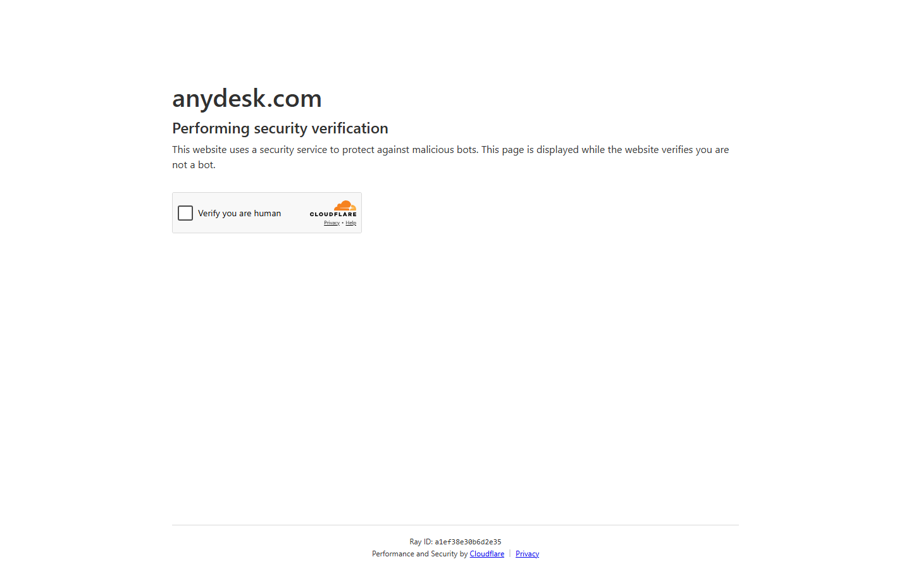


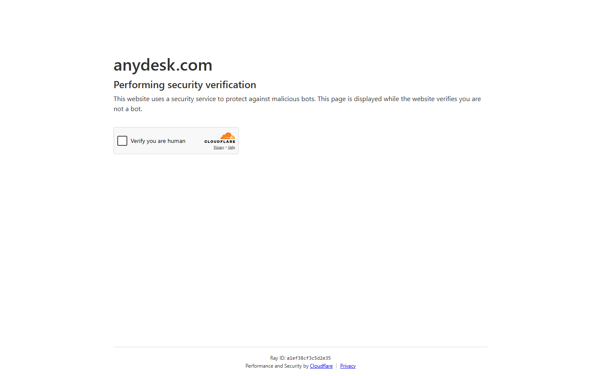

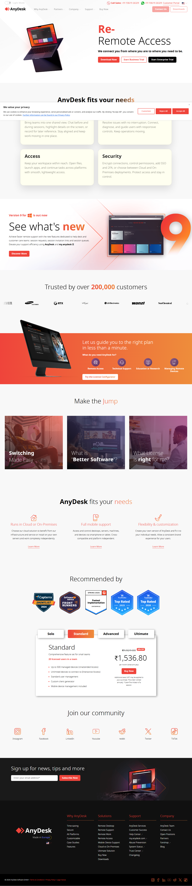

### Section Clips (screens/sections/)

*Clipped individual sections and components*

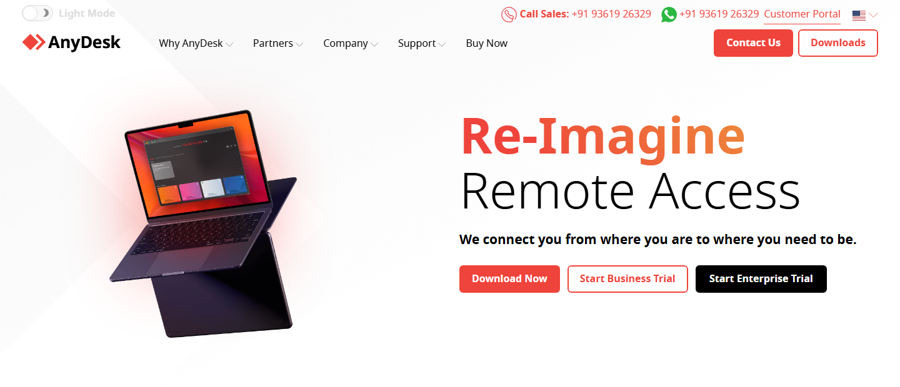

### Interaction States (screens/states/)

*Hover, focus, and active state captures*


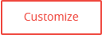


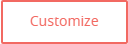


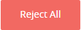


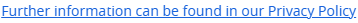

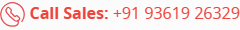


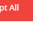


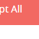

### Screenshot Index (screens/INDEX.md)

# Screenshot Index

## Scroll Journey

> Shows the cinematic state at each point of the page

| Scroll | Y Position | File |
|--------|-----------|------|
| 0% | 0px | `screens/scroll/scroll-000.png` |
| 17% | 975px | `screens/scroll/scroll-017.png` |
| 33% | 1893px | `screens/scroll/scroll-033.png` |
| 50% | 2868px | `screens/scroll/scroll-050.png` |
| 67% | 3842px | `screens/scroll/scroll-067.png` |
| 83% | 4760px | `screens/scroll/scroll-083.png` |
| 100% | 5735px | `screens/scroll/scroll-100.png` |

## Pages

| Page | URL | File |
|------|-----|------|
| The Fast Remote Desktop Application – AnyDesk | `https://anydesk.com/en` | `screens/pages/en.png` |
| Just a moment... | `https://anydesk.com/en/performance` | `screens/pages/en-performance.png` |
| Just a moment... | `https://anydesk.com/en/customization` | `screens/pages/en-customization.png` |
| Just a moment... | `https://anydesk.com/en/security` | `screens/pages/en-security.png` |
| Just a moment... | `https://anydesk.com/en/all-platforms` | `screens/pages/en-all-platforms.png` |

## Sections

| Page | Section | File |
|------|---------|------|
| en | #2 ([class*="hero"]) | `screens/sections/en-section-2.png` |

## Homepage Screenshots (screenshots/)


